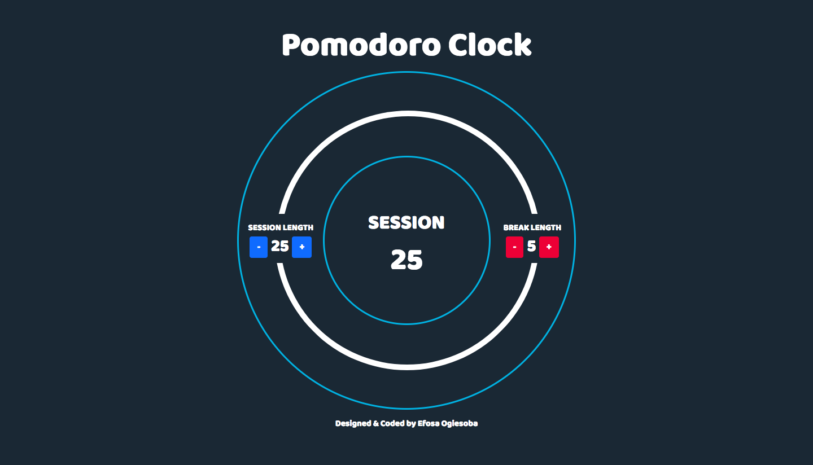

# Pomodoro Clock

<https://eogiesoba.github.io/Pomodoro_Clock_rep/> \
Version 1.0 \
Deployment Date: March 1, 2018  \
Contributors: Efosa Ogiesoba

# Purpose

Created a simple pomodoro timer with customizable session and break lengths for FreeCodeCamp.com zipline using HTML5,CSS3, Javascript, jQuery, & Bootstrap 4.

# Screenshot - 1 - Pomodoro Clock Page

# IceBox

Ideas for future development.

1) Add a continuous increase timer bar as oppose to a incremental increase timer bar.
